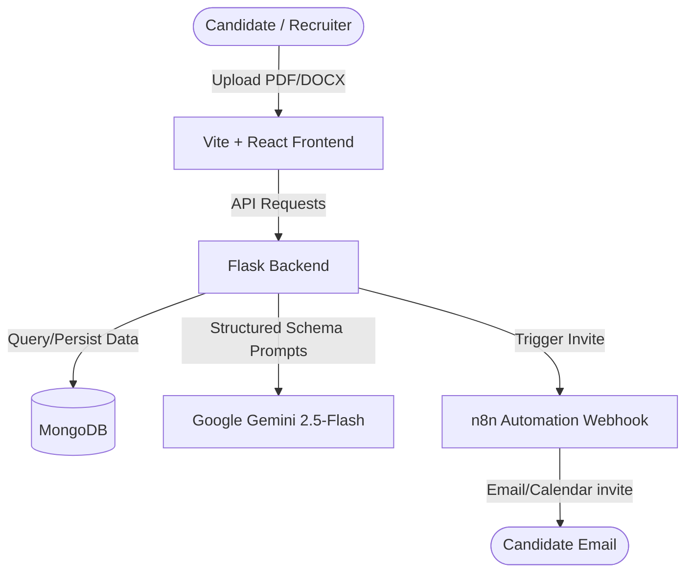

# ResumeAI — Enterprise-Grade AI Resume Analyzer & Builder

An advanced, full-stack AI-driven application designed to streamline the recruitment process and optimize resumes for Applicant Tracking Systems (ATS). ResumeAI leverages state-of-the-art Generative AI models to analyze candidate profiles, assess skill gaps, generate tailored applications using the STAR method, conduct interactive mock interviews, and facilitate batch recruiter screening with automated n8n pipeline invitations.

### 🌐 Live Deployment Links
*   **Web Application (Frontend):** [https://resume-analyzer-builder.vercel.app](https://resume-analyzer-builder.vercel.app)
*   **Production API (Backend):** [https://resume-ai-api.onrender.com](https://resume-ai-api.onrender.com) (Health status: `/health`)

---

## 🏗️ System Architecture & Workflow

ResumeAI is architected as a pnpm-managed monorepo combining a responsive, visualization-rich React frontend with a high-performance Flask backend coupled to MongoDB.



---

## 🚀 Key Features & Capabilities

### 1. ATS Analyzer & Skill Gap Insights
*   **Text Extraction Engine:** Uses `PyMuPDF` (`fitz`) and `python-docx` to extract raw text content cleanly from PDF and Word documents.
*   **Gemini 2.5-Flash Integration:** Leverages custom JSON schemas and analytical prompts (`temperature=0.2`) to output a strict analysis report covering keyword coverage, ATS compatibility checks, experience relevance, and core recommendations.
*   **Visual Skill Gap Analytics:** Translates missing qualifications into custom interactive UI elements and recommends actionable, personalized learning paths.

### 2. Tailored Resume Builder & Cover Letter Generator
*   **STAR Rewrite System:** Rewrite resume bullet points dynamically according to the STAR (Situation, Task, Action, Result) method using Gemini.
*   **Master Profile Syncing:** Manage a single "Master Profile" JSON document containing your career history, and extract/generate optimized copies customized for specific job descriptions.
*   **Cover Letter Creator:** Generates high-converting, targeted cover letters using parsed credentials and key target job keywords.
*   **PDF Export Engine:** Uses `jspdf` and `html-to-image` on the frontend for high-fidelity client-side PDF generation.

### 3. Interactive Mock Interview Prep
*   **Tailored Question Banks:** Generates contextual Technical, Behavioral, and Multiple Choice (MCQ) questions matching the user's resume history.
*   **Interactive Sessions:** Practice mock interviews with inline hints, correct answer highlights (for MCQs), and performance breakdowns.
*   **Session History:** Keeps historical records of past mock interviews in MongoDB, searchable from the dashboard.

### 4. Recruiter Mode (HR Batch Screening Leaderboard)
*   **Batch Processing Pipeline:** Upload multiple resume PDFs simultaneously.
*   **API Rate Limit Optimization:** Packs multiple resumes into a single massive, structured prompt, analyzing the entire pool in one API trip to eliminate rate limiting.
*   **Radar Metrics & Scoreboards:** Visualizes candidate scores across 5 metrics (Tech Skills, Experience, Education, Communication, Culture Fit) using `recharts` radar charts.
*   **n8n Automation Trigger:** Features a secure backend route `/api/hr_mode/trigger_invite` that formats candidate details and fires a post request to n8n webhooks to trigger downstream recruitment steps (calendar invites, draft outreach emails).

---

## 🛠️ Technology Stack

| Layer | Technology | Details |
|---|---|---|
| **Frontend Core** | React 18, TypeScript 5.9 | Type-safe user interfaces, client-side routing using `wouter` |
| **Styling & UI** | Tailwind CSS, shadcn/ui | Beautiful visual design system, glassmorphic headers, responsive layouts |
| **Visualizations**| Recharts | Interactive radar charts and keyword density gauges |
| **Backend API** | Flask 3.0.3, Python 3.12 | Lightweight API orchestration, modular routing with blueprints |
| **Database** | MongoDB (PyMongo) | Flexible document storage for profiles, reports, and interviews |
| **AI Processing**| Google GenAI SDK | Structured JSON schemas targeting `gemini-2.5-flash` |
| **Automation** | n8n Webhook Triggers | Real-time automated candidate outreach orchestration |

---

## 📂 Project Directory Structure

```text
├── backend/                  # Flask REST API
│   ├── api/                  # Blueprint modular routes
│   │   ├── ai.py             # Gemini client & core resume analysis prompt
│   │   ├── auth.py           # JWT auth & Google Sign-In handlers
│   │   ├── builder.py        # Master profile parser & STAR resume tailor
│   │   ├── dashboard.py      # History and analytics fetch
│   │   ├── hr_mode.py        # Batch analyzer pipeline & n8n webhook runner
│   │   ├── interview.py      # MCQ / Q&A generator & interactive session log
│   │   ├── parser.py         # PDF and DOCX parsing helper logic
│   │   └── upload.py         # Temp files handler & analysis save
│   ├── app.py                # Flask main entrypoint
│   ├── db.py                 # PyMongo client & thread-safe proxy handler
│   ├── requirements.txt      # Python dependencies
│   └── wsgi.py               # Production WSGI gateway interface
│
├── frontend/                 # React Single Page App
│   ├── src/
│   │   ├── pages/            # View Pages (Upload, HrMode, Dashboard, Builder)
│   │   ├── components/       # Reusable components (radar charts, nav, layout)
│   │   ├── hooks/            # Shared React custom hooks
│   │   ├── App.tsx           # Client Router & Global Providers
│   │   └── index.css         # Styling system & Tailwind declarations
│   ├── package.json          # Frontend dependencies & dev scripts
│   └── vite.config.ts        # Vite configuration
│
├── scripts/                  # Automated setup and deployment scripts
│   ├── deploy-all.sh         # Top-level deployment script orchestrator
│   ├── deploy-vercel.sh      # Automated Vercel CLI deployment script
│   └── render-env-checklist.md  # Production Environment checklist config
│
├── pnpm-workspace.yaml       # Monorepo workspaces definition
├── render.yaml               # Render Infrastructure-as-Code blueprint
└── vercel.json               # Vercel routing rules & builds configuration
```

---

## ⚙️ Local Development Setup

### 📋 Prerequisites
*   **Node.js:** v20+ with [pnpm](https://pnpm.io/) configured
*   **Python:** v3.12+
*   **Database:** Local MongoDB instance running at `mongodb://localhost:27017` or a cloud-hosted MongoDB Atlas URI.

---

### 1. Database Configuration
If using local MongoDB, start the service:
```bash
# macOS (Homebrew)
brew services start mongodb-community
```

---

### 2. Backend Installation & Start
1. Navigate to the `backend/` directory:
   ```bash
   cd backend
   ```
2. Create and activate a Python virtual environment:
   ```bash
   python3 -m venv venv
   source venv/bin/activate
   # Windows: venv\Scripts\activate
   ```
3. Install the application dependencies:
   ```bash
   pip install -r requirements.txt
   ```
4. Configure environment files:
   ```bash
   cp .env.example .env
   ```
   Modify `backend/.env` with your actual API keys:
   ```env
   PORT=5001
   MONGO_URI=mongodb://localhost:27017/saas_display
   JWT_SECRET=generate-a-secure-32-character-key
   GEMINI_API_KEY=AIzaSyYourGeminiAPIKeyHere
   GOOGLE_CLIENT_ID=your-google-oauth-client-id.apps.googleusercontent.com
   FRONTEND_URL=http://localhost:5173
   N8N_WEBHOOK_URL=https://your-n8n-instance.com/webhook/invite
   ```
5. Start the backend dev server:
   ```bash
   python app.py
   ```
   *The server will boot on [http://localhost:5001](http://localhost:5001). Test the health route at `http://localhost:5001/health`.*

---

### 3. Frontend Installation & Start
1. Return to the project root directory:
   ```bash
   cd ..
   ```
2. Configure frontend environment settings:
   ```bash
   cp frontend/.env.example frontend/.env
   ```
   Edit `frontend/.env`:
   ```env
   VITE_API_URL=http://localhost:5001
   VITE_GOOGLE_CLIENT_ID=your-google-oauth-client-id.apps.googleusercontent.com
   ```
3. Install workspace dependencies and run frontend:
   ```bash
   pnpm install
   pnpm run dev:frontend
   ```
   *The application will boot at [http://localhost:5173](http://localhost:5173).*

---

## 🌐 Production Deployment

### Automated Script Deployments
The repository includes automated scripts inside the `scripts/` directory to coordinate builds:
1. Create a `scripts/.env.deploy.local` file using [scripts/env.deploy.example](file:///Users/aryamanniboriya/Desktop/SaaS-Display/scripts/env.deploy.example) as a baseline.
2. Fill out all the API URLs and secrets inside it.
3. Run the deployment sequence:
   ```bash
   bash scripts/deploy-all.sh
   ```

---

### Manual Deployments

#### 1. Backend Web Service (Render)
This project includes a [render.yaml](file:///Users/aryamanniboriya/Desktop/SaaS-Display/render.yaml) configuration file, allowing for easy blueprint deployments on Render.
*   **Build Command:** `pip install -r requirements.txt`
*   **Start Command:** `gunicorn wsgi:app --bind 0.0.0.0:$PORT --workers 2 --timeout 120`
*   **Environment Variables:** Add keys for `MONGO_URI`, `JWT_SECRET`, `GEMINI_API_KEY`, `GOOGLE_CLIENT_ID`, and `FRONTEND_URL`.

#### 2. Frontend Web Application (Vercel)
*   Deploy using the project root directory. Vercel automatically reads the configuration parameters specified in [vercel.json](file:///Users/aryamanniboriya/Desktop/SaaS-Display/vercel.json) to build the React application out of the `frontend` subfolder.
*   **Environment Variables:** Set `VITE_API_URL` to your live Render endpoint, and `VITE_GOOGLE_CLIENT_ID` to your Google Developer credentials.

---

## 🔗 n8n Integration Pipeline Setup

In **HR Recruiter Mode**, users can trigger auto-invite outreach emails. When clicking the "Auto Invite" button:
1. The backend formats a structured payload representing the candidate's metrics, score, resume name, and email.
2. It executes a secure POST request to the `N8N_WEBHOOK_URL` containing:
   ```json
   {
     "action": "draft_interview_invite",
     "requestedBy": { "userId": "...", "email": "..." },
     "candidateName": "Aryaman Niboriya",
     "candidateEmail": "candidate@example.com",
     "score": 92,
     "matchReason": "Strong engineering match...",
     "filename": "Aryaman_Resume.pdf",
     "missingSkills": ["Docker"],
     "metrics": { "Tech Skills": 9, "Experience": 8 }
   }
   ```
3. Set up an n8n webhook node pointing to your trigger URL to parse this JSON payload, compose a professional invitation email, draft it to Gmail or Outlook, and notify the hiring team on Slack/Teams.

---

## 📝 License
This project is licensed under the MIT License - see the `LICENSE` file for details.
